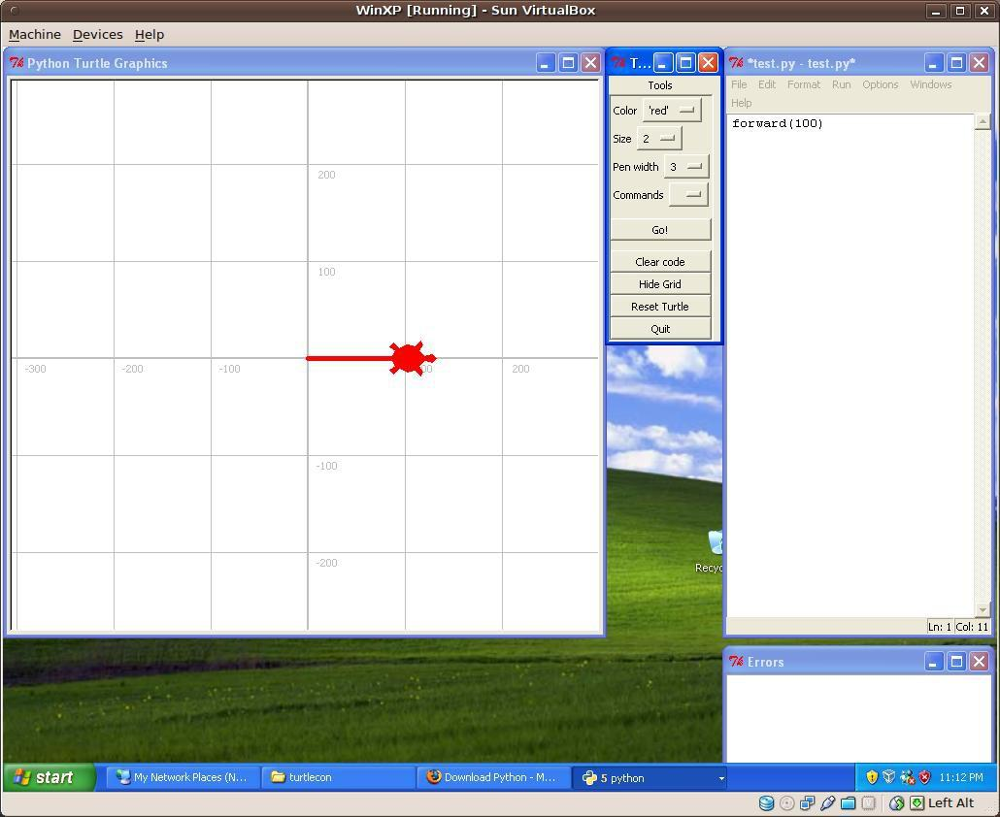

Turtlelab
=========

Turtlelab is an attempt to make life easier for young and/or very inexperienced Python coders using the turtle library. To do this a tool bar is available which will enter enter common commands into the code window, so that it's possible to code without typing as much.

When the "Go!" button is clicked the code is saved and run in a second interpreter instance. This gives almost the immediacy of a shell window, but with the ability to iteratively build up a program  

A grid and coordinate reporting have also been added to help young programmers keep track of where they are.

Screenshots
-----------

The screenshots below should give some idea of what turtlelab does:

1. Below the command menu is showing... clicking on a command will insert that command into the code window:

2. The 'forward' command has just been selected. The highlighted section needs to be replaced with a meaningful value.

3. After putting in 100 for the distance, the student clicks "Go!" and the code is saved and the command is executed:

4. Loops can be added...

5. and more complicated patterns can be created with the supplied random_color(), random_location(), random_size(), etc functions:

